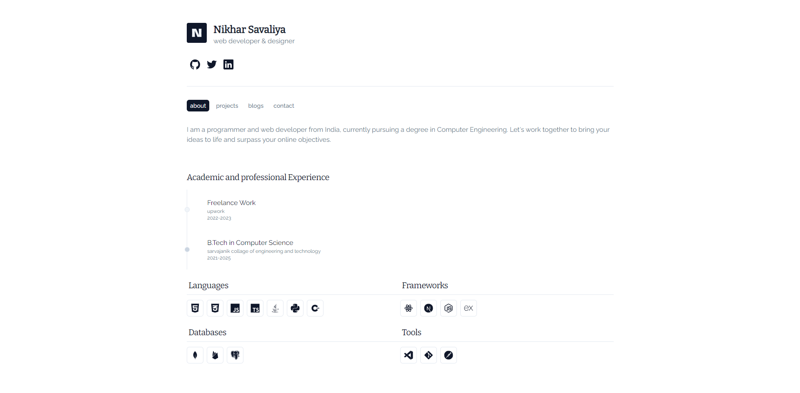

# ✨🦚 Nikhar's Portfolio Website

Welcome to Nikhar's portfolio website built with `Next.js`.



## Features

- **Minimal Layout**
- **Best UI**
- **Fully Responsive**

## Tech Stack

This project is built using the following technologies:

1. **Next.js**
2. **Tailwind CSS**
3. **shadcn UI & syntex UI**
4. **Framer Motion**

## Getting Started

Follow these steps to set up the project locally:

### Clone the Repository

```bash
git clone git@github.com:Nikhar-savaliya/portfolio.git
```

### Install Dependencies

Navigate to the project directory and install the required dependencies:

```bash
yarn
```

### Run the Development Server

Start the development server:

```bash
yarn dev
```

Open http://localhost:3000 in your browser to see the result.

---

inspiration and references is from this site.
[link](https://ansubkhan.com)
